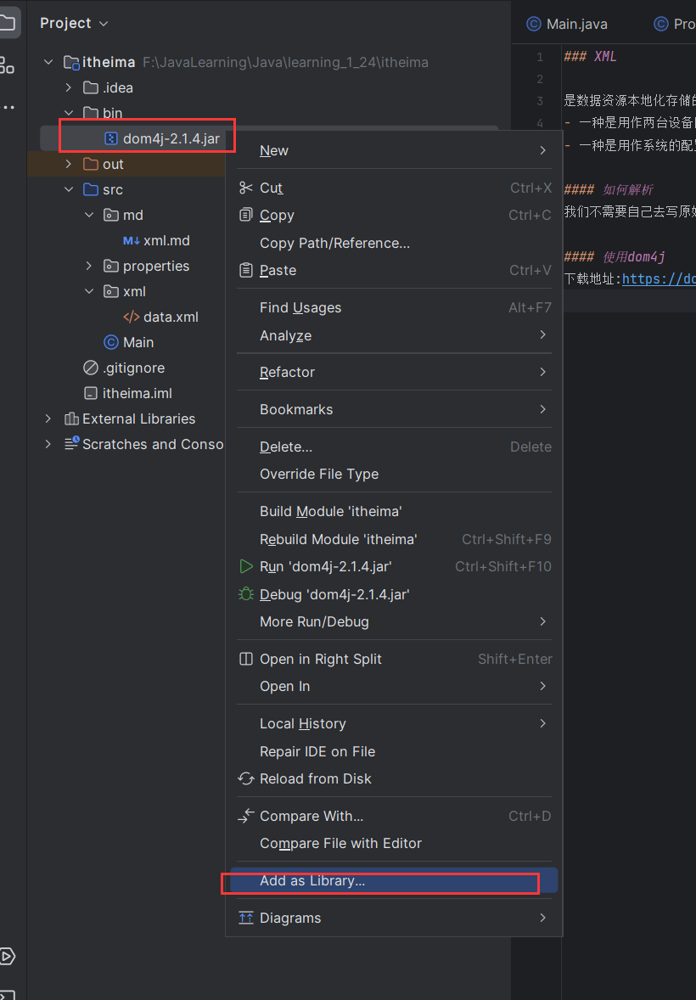
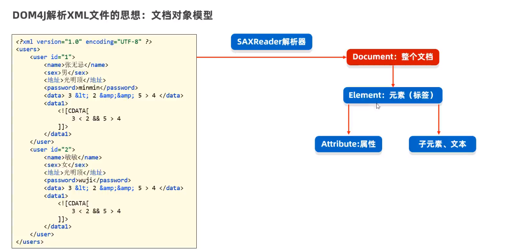
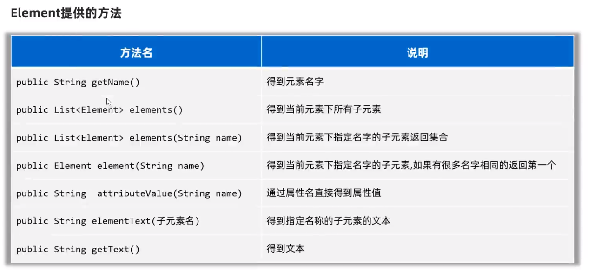
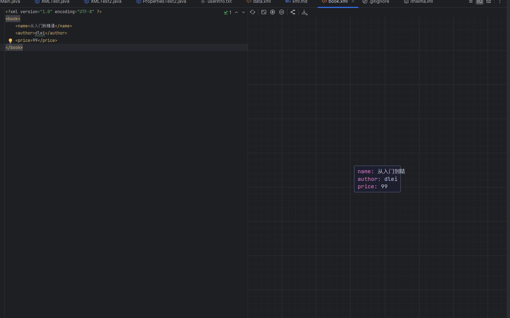

### XML

是数据资源本地化存储的一种方式,使用场景目前大致有两种
- 一种是用作两台设备网络之间的通信传输数据的方案;
- 一种是用作系统的配置文件

#### 如何解析
我们不需要自己去写原始的IO流去读取和解析XML文件,可以使用第三方框架`Dom4j`

#### 使用dom4j
下载地址:https://dom4j.github.io

之后右击点击Add as Library ...



#### Dom4j解析思想
文档对象模型


具体操作步骤:
- 拿到SAXReader对象
- 通过.read方法读取文件,获取Document文档元素
- 通过`document.getRootElement`方法获取根元素(root)元素
    ```java
        //创建一个Dom4J提供的解析器对象
        SAXReader reader =new SAXReader();
        //使用saxReader
        Document read = reader.read("src/xml/data.xml");
        //从文档流对象中获得根元素对象 root
        Element rootElement = read.getRootElement();
        System.out.println(rootElement.getName());
    ```
获取了根元素之后就可以用下面的方法进行操作了

```java
//        //获取根目录下的所有一级子元素
//        List<Element> elements = rootElement.elements();
//        for (Element element : elements) {
//            System.out.println("子元素名:"+element.getName());
//        }
        //拿到根目录下的某个子元素,如果下面有很多子元素,默认只拿第一个
        Element element = rootElement.element("data-item");
        System.out.println(element.element("sender").getText());

        //拿到元素的属性值
        Attribute id = element.attribute("id");
        System.out.println(id.getValue());


        //获取全部子元素
        System.out.println(element.elementText("sender"));
        System.out.println(element.elementText("receiver"));
        System.out.println(element.elementText("src"));
        System.out.println(element.elementText("current"));
        System.out.println(element.elementText("dest"));


        System.out.println("取出文本去除前后空格-----------------");
        System.out.println(element.elementTextTrim("sender"));
        System.out.println(element.elementTextTrim("receiver"));
        System.out.println(element.elementTextTrim("src"));
        System.out.println(element.elementTextTrim("current"));
        System.out.println(element.elementTextTrim("dest"));
```

### 生成XML格式的文件

可以直接使用字符串拼接的形式将数据拼接成带标签的格式,然后送给IO流去写入到文件中
```java
 public static void main(String[] args) {
        StringBuilder builder = new StringBuilder();
        builder.append("<?xml version=\"1.0\" encoding=\"UTF-8\" ?>");
        builder.append("<book>");


        builder.append("<name>");
        builder.append("从入门到精通");
        builder.append("</name>");


        builder.append("<author>");
        builder.append("dlei");
        builder.append("</author>");


        builder.append("<price>");
        builder.append("99");
        builder.append("</price>");


        builder.append("</book>");
        try (
                FileWriter writer = new FileWriter(new File("src/xml/book.xml"));
        ) {
            writer.write(builder.toString());
        } catch (Exception e) {
            e.printStackTrace();
        }
    }
```
